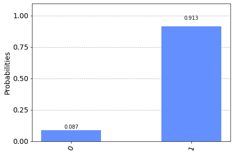

```python
%matplotlib inline
# Importing standard Qiskit libraries and configuring account
from qiskit import QuantumCircuit, execute, Aer, IBMQ, QuantumRegister
from qiskit.compiler import transpile, assemble
from qiskit.tools.jupyter import *
from qiskit.visualization import *
from qiskit.quantum_info import random_statevector
from qiskit.extensions import Initialize

# Loading your IBM Q account(s)
provider = IBMQ.load_account()
```

    ibmqfactory.load_account:WARNING:2020-08-01 06:45:11,115: Credentials are already in use. The existing account in the session will be replaced.


```python
from qiskit.visualization import plot_histogram
from math import sqrt, pi
import numpy as np
```


```python
qc = QuantumCircuit(1)
psi = random_statevector(2).data #1큐빗으로 구성된 양자 회로를 구성합니다.
init_gate = Initialize(psi)
qc.append(init_gate, [0] )
qc.draw('text')
```


<pre style="word-wrap: normal;white-space: pre;background: #fff0;line-height: 1.1;font-family: &quot;Courier New&quot;,Courier,monospace">     ┌───────────────────────────────────────────────┐
q_0: ┤ initialize(0.23326+-0.18051j,0.42134+0.8576j) ├
     └───────────────────────────────────────────────┘</pre>


```python
state = execute(qc,backend).result().get_statevector() # Execute the circuit
print(state)
```

    [0.23326479-0.18051426j 0.42133699+0.85759972j]


```python
results = execute(qc,backend).result().get_counts()
plot_histogram(results)

```





```python

```
